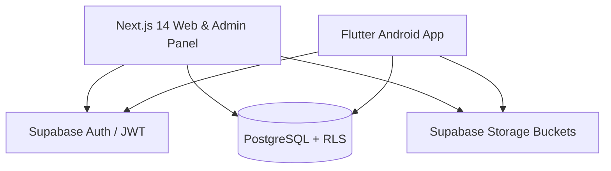

# 📐 System Architecture & Design

## Overview
The **Indian Short Films Platform** is built using a decoupled Monorepo architecture designed for high scalability, real-time streaming metadata, and role-based access control (RBAC).

## Core Technology Stack
- **Web App:** Next.js 14+ (App Router), TypeScript, Tailwind CSS, Lucide Icons, Custom Video Player.
- **Mobile App:** Flutter + Dart, Riverpod 2.5, GoRouter, Cached Network Image, Chewie / Video Player.
- **Backend Infrastructure:** Supabase Cloud (PostgreSQL 15+, Auth, Row Level Security, Storage Buckets).

## Key Systems
1. **Video Streaming Architecture:** HTML5 `<video>` custom player supporting MP4 & HLS stream URLs, with automatic watch position tracking (`watch_history` table) for "Continue Watching" playback restoration.
2. **Trending Algorithm:** Deterministic popularity scoring formula (`score = views * 1.0 + likes * 3.0 + rating_avg * rating_count * 2.0`) calculated periodically by Postgres stored procedure.
3. **Role-Based Authorization:** User roles (`user`, `filmmaker`, `admin`, `moderator`) enforced via JWT claim metadata and PostgreSQL RLS policies.
